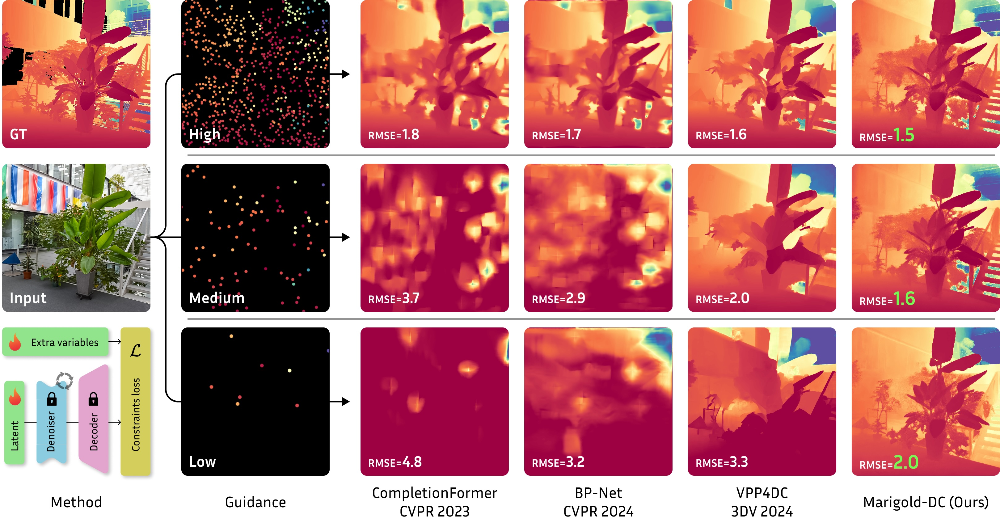

# ⇆ Marigold-DC: Zero-Shot Monocular Depth Completion with Guided Diffusion

[](https://marigolddepthcompletion.github.io)
[](http://arxiv.org/abs/2412.xxxxx)
[](https://huggingface.co/spaces/prs-eth/marigold-dc)
[](https://www.apache.org/licenses/LICENSE-2.0)

This repository represents the official implementation of the paper titled "Marigold-DC: Zero-Shot Monocular Depth Completion with Guided Diffusion".

Photogrammetry and Remote Sensing team: 
[Massimiliano Viola](https://www.linkedin.com/in/massimiliano-viola/), 
[Kevin Qu](https://www.linkedin.com/in/kevin-qu-b3417621b/), 
[Nando Metzger](https://nandometzger.github.io/), 
[Bingxin Ke](http://www.kebingxin.com/),
[Alexander Becker](https://scholar.google.ch/citations?user=Wle2GmkAAAAJ&hl=en), 
[Konrad Schindler](https://scholar.google.com/citations?user=FZuNgqIAAAAJ&hl=en),
[Anton Obukhov](https://www.obukhov.ai/).



## 🛠️ Setup

📦 Clone the repository:
```bash
git clone https://github.com/prs-eth/Marigold-DC.git
cd Marigold-DC
```

🐍 Create python environment:
```bash
python -m venv venv/marigold_dc
```

⚡ Activate the environment:
```bash
source venv/marigold_dc/bin/activate
```

💻 Install the dependencies:
```bash
pip install -r requirements.txt
```

## 🚀 Usage

The script performs densification of the input sparse depth, provided as a sparse numpy array, 
and saves the output as a dense numpy array, along with the visualization. 
Optimal default settings are applied.
By default, it processes the [teaser image](data/image.png) and uses [100-point guidance](data/sparse_100.npy). 

🏃🏻‍♂️‍➡️ Simply run as follows:
```bash
python -m marigold_dc
```

🧩 Customize image and sparse depth inputs as follows:
```bash
python -m marigold_dc \
    --in-image <PATH_RGB_IMAGE> \
    --in-depth <PATH_SPARSE_DEPTH> \
    --out-depth <PATH_DENSE_DEPTH>
```

🛠️ Customize other settings:
- `--num_inference_steps <int>` specifies the number of diffusion inference steps.
- `--checkpoint <path>` allows overriding the base monocular depth estimation model checkpoint; can be a local path or a Hugging Face repository.

## 🏋️‍♂️ Training

None — the method is purely test-time; please refer to the paper for more details.

## ⬇ Checkpoint cache
By default, the [checkpoint](https://huggingface.co/prs-eth/marigold-depth-v1-0) is stored in the Hugging Face cache, 
which defaults to the home directory on Linux and Mac. 
This is often problematic in cluster environments.
The `HF_HOME` environment variable defines the cache location and can be overridden, e.g.:

```
export HF_HOME=/large_volume/cache
```

## 🦿 Evaluation on test datasets
Coming soon

## Abstract

Depth completion upgrades sparse depth measurements into dense depth maps, guided by a conventional image. 
Existing methods for this highly ill-posed task operate in tightly constrained settings, 
and tend to struggle when applied to images outside the training domain, 
as well as when the available depth measurements are sparse, irregularly distributed, or of varying density. 
Inspired by recent advances in monocular depth estimation, 
we reframe depth completion as image-conditional depth map generation, guided by a sparse set of measurements. 
Our method, Marigold-DC, builds on a pretrained latent diffusion model (LDM) for depth estimation and injects 
the depth observations as test-time guidance, via an optimization scheme that runs in tandem with the iterative 
inference of denoising diffusion. The method exhibits excellent zero-shot generalization across a diverse range 
of environments and handles even extremely sparse guidance effectively. Our results suggest that contemporary 
monodepth priors greatly robustify depth completion: it may be better to view the task as recovering dense depth 
from (dense) image pixels, guided by sparse depth; rather than as inpainting (sparse) depth, guided by an image.

## 📢 News

2024-12-18: Code release (this repository).

## 🎓 Citation
```bibtex
@misc{viola2024marigolddc,
    title={Marigold-DC: Zero-Shot Monocular Depth Completion with Guided Diffusion}, 
    author={Massimiliano Viola and Kevin Qu and Nando Metzger and Bingxin Ke and Alexander Becker and Konrad Schindler and Anton Obukhov},
    year={2024},
    eprint={2412.xxxxx},
    archivePrefix={arXiv},
    primaryClass={cs.CV},
}
```

## 🎫 License

The code of this work is licensed under the Apache License, Version 2.0 (as defined in the [LICENSE](LICENSE.txt)).
